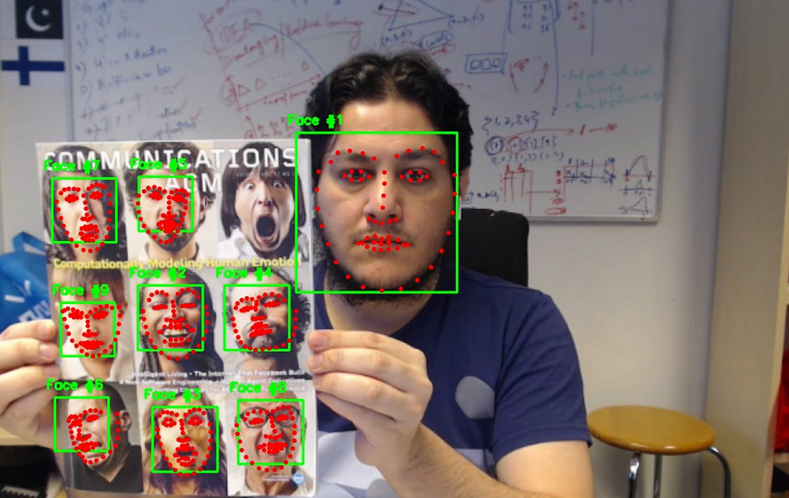

# Real-time Facial Landmark Detection

This repo is mainly for real-time face and landmark detection. However, It can be equally used for other images and videos in general.

1. Install the required packages.
2. Download the 68-point shape predictor from [here](https://drive.google.com/file/d/1CE881Hh4ih-13tE90rVf8opIKq_clZPK/view?usp=sharing).
3. Run the code. Enjoy!

Live demo here on [YouTube](https://youtu.be/U2GVMsShIP0).

